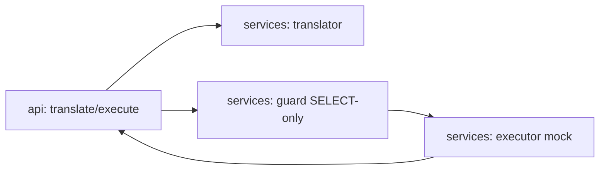

# agent-sql-search

[](https://github.com/Shamanchi/agent-sql-search/actions/workflows/ci.yml)
[](https://www.python.org/)
[](./Dockerfile)
[](./LICENSE)

> **English TL;DR:** FastAPI NL-to-SQL agent: rule-based translation of plain-English questions into SELECT queries over a mock schema, plus a safe read-only executor (SELECT only, anything else rejected). Fully offline, no tokens needed.

Агент поиска по SQL: перевод вопросов на естественном языке в SELECT-запросы по эвристикам и безопасное выполнение только на чтение (всё кроме SELECT отклоняется). Mock-схема и данные, работает офлайн.

Источник темы: `Hands-On-AI-Engineering / P-108 (agentic_sql_search)` — идею и постановку взяли из каталога, код и тексты написаны с нуля.

## Какую задачу решает

Аналитику нужно быстро достать данные, не зная SQL: агент понимает «покажи пользователей старше 30», строит безопасный запрос, проверяет его (только SELECT, только известные таблицы/колонки) и выполняет на mock-данных.

## Архитектура



Слои: `api/` → `services/` → `core/`, настройки через `pydantic-settings`.

## Быстрый старт

```bash
cp .env.example .env
pip install -r requirements.txt
uvicorn app.main:app --reload
curl -X POST http://127.0.0.1:8000/api/v1/translate -H "Content-Type: application/json" -d "{\"question\": \"show users older than 30\"}"
```

Docker:

```bash
docker compose up --build
```

## API

- `GET /api/v1/health` — проверка сервиса.
- `GET /api/v1/schema` — таблицы и колонки mock-схемы.
- `POST /api/v1/translate` — вопрос → SQL. Тело: `{"question": "show users older than 30"}`.
- `POST /api/v1/execute` — выполнить SQL (только SELECT). Тело: `{"sql": "SELECT name, age FROM users WHERE age > 30"}`.

Пример ответа `translate` (сокращённо):

```json
{
  "question": "show users older than 30",
  "sql": "SELECT name, age FROM users WHERE age > 30",
  "table": "users",
  "confidence": 0.85
}
```

## Переменные окружения (.env)

| Переменная | Назначение | По умолчанию |
|---|---|---|
| `MAX_ROWS` | Макс. строк в ответе execute | `100` |
| `DEFAULT_LIMIT` | LIMIT по умолчанию в translate | `50` |
| `APP_HOST` / `APP_PORT` | Хост/порт API | `0.0.0.0` / `8000` |

Полный список — в [.env.example](./.env.example).

## Тесты

```bash
pip install -r requirements.txt
pytest -q
pytest -q -m integration
```

Unit-тесты без сети. Интеграционные (`-m integration`) — через TestClient, тоже без сети.

## Контакты

- Telegram: @PavelYrevichh
- Email: Lietman46@mail.ru
- GitHub: Shamanchi
- FL.ru: https://www.fl.ru/users/Shamanchi
